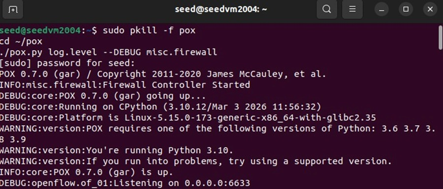

# SDN-Based Broadcast Traffic Control using Ryu

## Overview
This project demonstrates the use of Software Defined Networking (SDN) to control broadcast traffic in a network.  
A custom controller is implemented using the Ryu framework to detect and restrict unnecessary broadcast packets, improving overall network efficiency.

---

## Objective
- Understand SDN architecture and controller-based networking  
- Implement packet inspection using a controller  
- Detect broadcast traffic in real-time  
- Reduce network congestion caused by broadcast flooding  

---

## Technologies Used
- Ubuntu (Mininet VM)  
- Mininet (Network Emulator)  
- Python  
- Ryu Controller  
- OpenFlow Protocol  

---

## System Architecture
The system consists of the following components:

- Mininet: Creates a virtual network topology  
- Switches (OpenFlow): Forward packets based on controller instructions  
- Ryu Controller: Centralized control logic for packet handling  

---

## Implementation

### 1. Network Topology
A simple topology is created using Mininet:

sudo mn --topo single,3

This creates:
- 3 Hosts (h1, h2, h3)
- 1 Switch

---

### 2. Controller Logic
The controller inspects incoming packets and checks for broadcast addresses:

if dst == "ff:ff:ff:ff:ff:ff":
    print("Broadcast Blocked")
    return

- Broadcast packets are identified using MAC address  
- Unnecessary flooding is prevented  

---

### 3. Running the Controller

ryu-manager broadcast_control.py

---

### 4. Testing

pingall

- Communication between hosts is tested  
- Broadcast behavior is observed  

---

## Results
- Broadcast packets are successfully detected  
- Unnecessary flooding is reduced  
- Network efficiency is improved  

---

## Output Screenshots
## Output Screenshots

### Controller Start

---

## Key Concepts
- Centralized control in SDN  
- Packet inspection using controller  
- Broadcast traffic handling  
- OpenFlow-based communication  

---

## Future Work
- Implement dynamic traffic filtering rules  
- Add GUI visualization  
- Extend to larger and complex networks  
- Integrate intelligent traffic analysis  

---

## Conclusion
This project demonstrates how SDN enables programmable and flexible control of network traffic.  
Using a Ryu controller, broadcast traffic can be efficiently managed, reducing unnecessary network overhead.

---

## Author
Jyothika  
AIML Engineering Student
