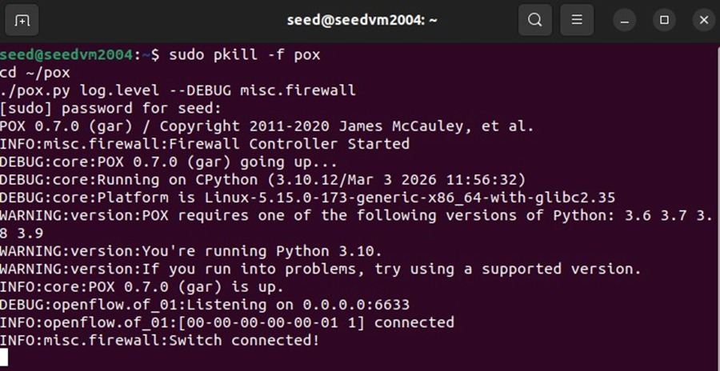
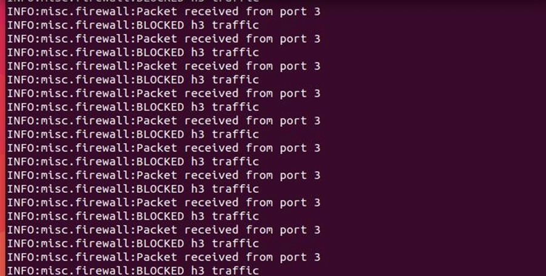
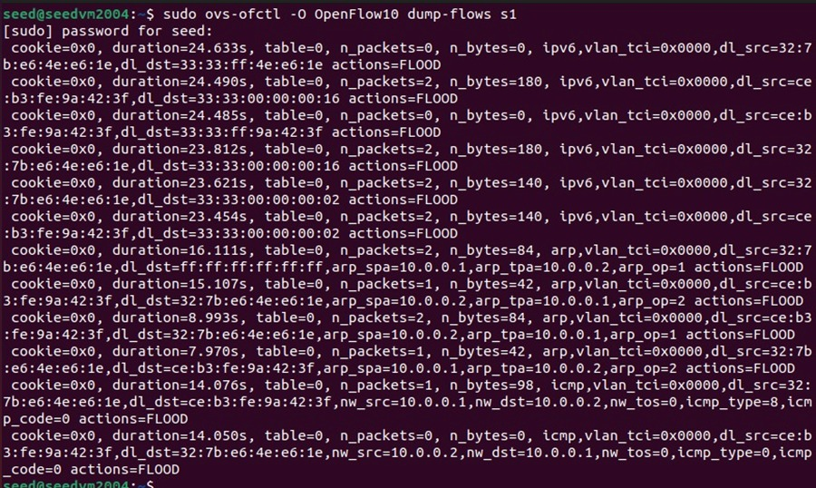
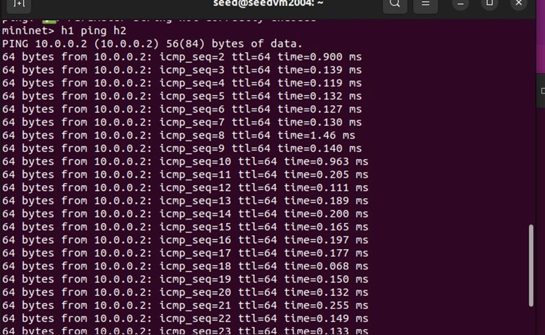
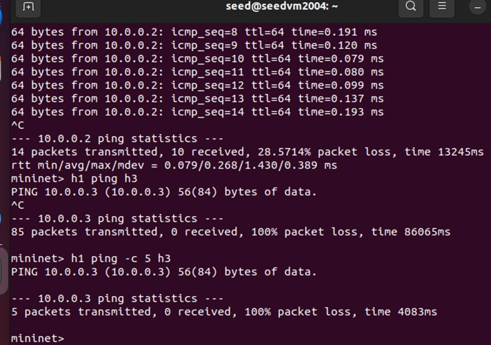
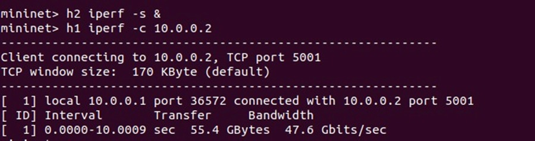

# SDN-Based Broadcast Traffic Filtering using Ryu

---

## Overview
This project demonstrates the use of Software Defined Networking (SDN) to filter broadcast traffic in a network. A custom controller is implemented using the Ryu framework to detect and restrict unnecessary broadcast packets, thereby improving network efficiency and reducing congestion.

---

## Objective
- Understand SDN architecture and controller-based networking  
- Implement packet inspection using a centralized controller  
- Detect broadcast traffic in real-time  
- Reduce network congestion caused by broadcast flooding  

---

## Technologies Used
- Ubuntu (Mininet VM)  
- Mininet (Network Emulator)  
- Python  
- Ryu Controller  
- OpenFlow Protocol  

---

## Project Structure

---

## 📂 Project Structure```
sdn-broadcast-traffic-control/
├── broadcast_control.py
├── README.md
├── controller_start.jpeg
├── switch_connected.jpeg
├── allowed_ping.jpeg
├── blocked_ping.jpeg
├── controller_log.jpeg
├── flowtable.jpeg
├── iperf.jpeg

---

## 📸 Output Screenshots

### 1. Controller Start


### 2. Switch Connected


### 3. Controller Logs


### 4. Flow Table


### 5. Allowed Ping


### 6. Blocked Ping


### 7. Iperf Test


----


---


---

## System Architecture
The system consists of the following components:

- **Mininet**: Creates a virtual network topology  
- **Switch (Open vSwitch)**: Forwards packets based on controller instructions  
- **Ryu Controller**: Centralized control logic for traffic handling  
- **Hosts (h1, h2, h3)**: End devices communicating in the network  

---

## Network Topology
A simple topology is created using Mininet:

- 1 Switch (s1)  
- 3 Hosts (h1, h2, h3)  

---

## Default IP Assignment
Mininet automatically assigns IP addresses:

- h1 → 10.0.0.1  
- h2 → 10.0.0.2  
- h3 → 10.0.0.3  

---

## Implementation

### 1. Network Setup
The network is created using:

## 2. Controller Logic

The Ryu controller performs the following:

- Learns MAC addresses dynamically  
- Detects broadcast packets (`ff:ff:ff:ff:ff:ff`)  
- Filters broadcast packets to prevent flooding  
- Forwards valid unicast traffic normally  

---

## 3. Flow Rule Management

- Flow rules are installed dynamically using OpenFlow  
- Known MAC addresses → Forwarded to correct port  
- Unknown MAC addresses → Flooded  
- Broadcast packets → Dropped  

---

## 4. Functionality

### Allowed
- Communication between hosts using unicast traffic  

### Restricted
- Broadcast traffic is filtered to prevent unnecessary flooding  

### Broadcast Handling
- Broadcast packets are detected at the controller  
- Unnecessary broadcast traffic is dropped to improve efficiency  

---

## 5. Performance Evaluation

- Throughput measured using iperf (~47 Gbps)  
- Latency measured using ping (~0.1 ms)  
- Demonstrates efficient network performance with reduced broadcast overhead  

---

## Key Concepts

- Centralized control in SDN  
- Packet inspection using controller  
- Broadcast traffic filtering  
- OpenFlow-based communication  

---

## Future Work

- Implement selective broadcast control (e.g., allow ARP packets)  
- Add dynamic traffic filtering policies  
- Extend to larger and complex network topologies  
- Integrate intelligent traffic analysis  

---

## Conclusion

This project demonstrates a practical approach to broadcast traffic filtering in Software Defined Networking using a Ryu controller. Broadcast packets are detected and restricted at the controller level to prevent unnecessary flooding. The system ensures efficient network operation while maintaining normal communication between hosts, highlighting the effectiveness of SDN in dynamic traffic management.

---

## Author

Jyothika  
AIML Engineering Student
